## Аннотация

Определение режима течения газожидкостной смеси в трубе — необходимый этап проектирования систем сбора и
транспорта углеводородов: от режима течения зависят потери давления, удержание жидкости (holdup), интенсивность
коррозии, тепловые потери и риск возникновения гидроударов при переходе к пробковому режиму. В работе выполнено
сопоставление классификации режимов течения, полученной двумя классическими корреляциями — механистической
моделью Ансари и др. (Ansari et al., 1994) для восходящего наклонно-вертикального потока и полуэмпирической
моделью Беггса-Брилла (Beggs, Brill, 1973) для труб произвольного наклона, реализованными в авторском
программном обеспечении FlowMapUtility, — с результатами промышленного симулятора многофазного течения OLGA
(Schlumberger), принятого в работе за отраслевой референс. Сравнение выполнено на 10 сценариях (5 скважин и
5 трубопроводов) с углами наклона от 0° до 90°, на регулярной сетке 100×100 точек по приведённым скоростям
жидкости и газа (10 000 точек на кейс, 100 000 точек всего). Показано, что для около-вертикальных скважин
(модель Ансари) совпадение классификации с OLGA составляет 68–77%, тогда как для горизонтальных и наклонных
трубопроводов (модель Беггса-Брилла) — 38–60%, причём точность в целом снижается с ростом угла наклона.
Установлено, что основной источник расхождений — структурные ограничения самих классических корреляций
(независимость порога перехода в кольцевой режим от скорости жидкости у модели Ансари; полное отсутствие угла
наклона в классификации режима у модели Беггса-Брилла; заниженная по сравнению с OLGA площадь расслоенного
режима у модели Беггса-Брилла), а не ошибки программной реализации. Результаты показывают, что использование
классических корреляций для построения карт режимов течения без модификаций требует осторожности, особенно для
наклонных трубопроводов с углом наклона более 30°.

**Ключевые слова:** многофазный поток, режим течения, карта режимов течения, корреляция Ансари, корреляция
Беггса-Брилла, OLGA, верификация расчётных моделей, приведённая скорость

## 1. Введение

Совместное течение газа и жидкости в трубе может принимать качественно разные пространственные конфигурации
(пузырьковую, пробковую, дисперсно-пузырьковую, расслоённую, кольцевую и др.), объединяемые понятием *режим
течения* (flow pattern / flow regime). Режим течения — не второстепенная деталь, а определяющий фактор для
инженерного расчёта многофазного потока: от него зависят применяемая корреляция для градиента давления и
удержания жидкости, интенсивность коррозии и эрозии, эффективность теплообмена, а также риск возникновения
гидроударов и переполнения сепараторов при пробковом (slug) режиме. Ошибка в определении режима течения
приводит к системной ошибке во всех последующих гидравлических расчётах, поэтому точность карт режимов течения
— предмет постоянных исследований в трубопроводной гидравлике с 1950-х годов.

Исторически сложилось два подхода к построению карт режимов: (1) классические корреляции — эмпирические и
полуэмпирические зависимости, полученные аппроксимацией лабораторных данных на трубах малого диаметра, и
(2) коммерческие механистические симуляторы многофазного потока (OLGA, PIPESIM, LedaFlow и др.), использующие
более сложные, часто проприетарные модели с большим числом эмпирических замыканий. Классические корреляции
остаются массово востребованными из-за простоты реализации и вычислительной дешевизны, но их применимость за
пределами условий, на которых они были откалиброваны, заранее не гарантирована.

Настоящая работа посвящена количественной верификации двух классических корреляций — модели Ансари (Ansari et
al., 1994) для восходящего наклонно-вертикального потока и модели Беггса-Брилла (Beggs, Brill, 1973) для труб
произвольного наклона, — реализованных в открытом программном обеспечении FlowMapUtility, против карт режимов
течения, построенных промышленным симулятором OLGA (Schlumberger) для тех же условий. Целью работы является
не столько подтверждение или опровержение корректности реализации корреляций (она заведомо соответствует
исходным публикациям, см. §3.1), сколько количественная оценка *расхождения самих корреляций с промышленным
эталоном* и объяснение природы этого расхождения через структурные особенности исходных моделей.

Задачи работы:

1. Провести обзор существующих подходов к определению режима течения — от ранних эмпирических карт до
   механистических моделей и коммерческих симуляторов (§2).
2. Описать методику сопоставления двух классификаций режимов на сетке приведённых скоростей и официальное
   соответствие кодов режимов FlowMapUtility и OLGA (§3).
3. Количественно оценить долю совпадения классификации для 10 представительных сценариев скважин и
   трубопроводов (§4).
4. Объяснить наблюдаемые расхождения через структурные особенности корреляций и сформулировать практические
   рекомендации (§5–§6).

## 2. Обзор методов определения режима течения

### 2.1 Эмпирические карты режимов

Первые карты режимов течения строились как эмпирические диаграммы в координатах, связанных с массовыми или
объёмными расходами фаз, без явной физической модели перехода между режимами. Наиболее известна ранняя карта
Бейкера (Baker, 1954) для горизонтальных труб, построенная по данным на трубах малого диаметра и до сих пор
встречающаяся в инженерных справочниках, несмотря на ограниченную применимость к современным диаметрам труб и
свойствам флюидов. Позднее Мандхейн с соавторами (Mandhane, Gregory, Aziz, 1974) предложили карту в координатах
приведённых скоростей газа и жидкости (Vsg–Vsl) — именно этот формат координат стал стандартом де-факто и
используется в настоящей работе. Эмпирические карты просты в применении, но их границы режимов являются
статическими линиями на плоскости и не учитывают явно диаметр трубы, свойства флюидов и угол наклона, что
ограничивает их точность за пределами условий калибровки.

### 2.2 Механистические и полуэмпирические модели

Механистические модели, в отличие от чисто эмпирических карт, выводят границы режимов из физических критериев
устойчивости (например, устойчивость расслоённого течения по Кельвину-Гельмгольцу, критическая скорость
дробления пузырьков и т.п.), откалиброванных по экспериментальным константам. Основополагающей работой стала
модель Тайтела-Даклера (Taitel, Dukler, 1976) для горизонтальных и слабонаклонных труб, впоследствии обобщённая
Барнеа (Barnea, 1987) в единую модель, применимую при произвольном угле наклона трубы от -90° до +90°.

Для восходящего течения в наклонно-вертикальных скважинах отдельное направление развития механистических
моделей представлено работой Ансари и др. (Ansari et al., 1994) — составной (composite) моделью, объединяющей
критерии перехода между пузырьковым, пробковым, дисперсно-пузырьковым и кольцевым режимами специально для
условий добывающих скважин. Именно эта модель реализована в FlowMapUtility как `AnsariModel` (см. §3.1) и
используется в настоящей работе для сценариев скважин (кейсы 1, 2, 3, 7, 10, угол 75–90°).

Отдельную нишу занимает полуэмпирическая корреляция Беггса-Брилла (Beggs, Brill, 1973), полученная по
результатам экспериментов на прозрачной трубе диаметром 1–1.5 дюйма с изменяемым углом наклона от -90° до +90°.
Важная особенность оригинальной методики Беггса-Брилла — классификация режима (segregated / intermittent /
distributed, с переходной зоной transition) определяется **только** числом Фруда смеси и объёмным расходным
содержанием жидкости без учёта угла наклона трубы; угол наклона в оригинальной работе 1973 года используется
лишь для последующей поправки удержания жидкости внутри уже определённого режима, а не для самой границы
режима. Это структурное свойство исходной модели, а не упрощение при программной реализации — оно подробно
разбирается в §5 как одна из основных причин расхождений с OLGA.

### 2.3 Коммерческие симуляторы многофазного течения

Коммерческие транзиентные симуляторы многофазного потока, из которых наиболее распространён OLGA (Schlumberger/
SLB), используют собственный, проприетарный набор замыкающих корреляций для перехода между режимами, не
публикуемый в полном объёме в открытой печати. Поэтому в настоящей работе OLGA рассматривается исключительно
как источник эталонных карт режимов ("чёрный ящик") для сравнения, без попытки воспроизвести или объяснить
внутреннюю логику самого симулятора. Официальная легенда кодов режимов на экспортируемой карте OLGA (см. §3.3)
при этом документирована и однозначна.

## 3. Материалы и методы

### 3.1 Программная реализация корреляций

Обе корреляции реализованы в модулях `src/flowmaputility/correlations/ansari.py` и
`src/flowmaputility/correlations/beggs_brill.py` пакета FlowMapUtility. Классификация режима возвращается в виде
кода `FlowPatternCode` (перечисление в `src/flowmaputility/correlations/base.py`, см. легенду в §3.3).

Модель Ансари (`AnsariModel._fpup`) для восходящего потока (75° ≤ угол ≤ 90°) определяет режим через три
граничные скорости газа `vsg1`, `vsg2`, `vsg3`, рассчитываемые итерационно (`_mpoint`, `_dbtran`) с учётом
диаметра трубы, шероховатости, плотностей, вязкостей фаз и поверхностного натяжения. Ключевая для дальнейшего
анализа деталь — порог перехода в кольцевой режим:

$$v_{sg,3} = \frac{3.1\,\bigl(\sigma \, g \sin\alpha \,(\rho_l - \rho_g)\bigr)^{0.25}}{\sqrt{\rho_g}}$$

не зависит от приведённой скорости жидкости $v_{sl}$ — это прямое следствие формулы из оригинальной работы
Ансари и др. (1994), а не артефакт реализации.

Модель Беггса-Брилла (`BeggsBrillModel._flow_pattern`, диапазон углов 0°–75°) классифицирует режим по
безразмерному объёмному содержанию жидкости $\lambda_l = v_{sl}/(v_{sl}+v_{sg})$ и числу Фруда смеси
$N_{Fr} = (v_{sl}+v_{sg})^2/(g D)$ по системе пороговых неравенств:

$$
\text{Stratified: } N_{Fr} \le 0.000925\,\lambda_l^{-2.468}; \qquad
\text{Distributed: } N_{Fr} \ge 316\,\lambda_l^{0.302} \ \text{или} \ N_{Fr} \ge 0.5\,\lambda_l^{-6.738};
$$

промежуточные значения классифицируются как Transition или Intermittent (в выводе приложения оба объединены в
код SLUG, см. §3.3). Ни в одном из этих неравенств угол наклона трубы не участвует — см. обсуждение в §5.

### 3.2 Тестовые сценарии

Для сопоставления с OLGA подготовлено 10 сценариев, охватывающих диапазон углов наклона от 0° (горизонтальный
трубопровод) до 90° (вертикальная скважина), с различными диаметрами труб, свойствами флюидов и давлениями —
5 сценариев рассчитаны моделью Ансари (скважины) и 5 — моделью Беггса-Брилла (трубопроводы). Таблица широкая —
её можно прокрутить по горизонтали:

<div style="overflow-x:auto; -webkit-overflow-scrolling:touch; border:1px solid #ddd; border-radius:4px; padding:4px;">

|   case_id | description                        | model       |   D,м |     k,м |   angle,° |   rho_l,кг/м3 |   rho_g,кг/м3 |   mu_l,Па*с |   mu_g,Па*с |   sigma,Н/м |    P,Па |   T,K |   Vsl_min |   Vsl_max |   Vsg_min |   Vsg_max |
|----------:|:-----------------------------------|:------------|------:|--------:|----------:|--------------:|--------------:|------------:|------------:|------------:|--------:|------:|----------:|----------:|----------:|----------:|
|         1 | Верт. газоконд. скважина           | ansari      |  0.1  | 1.5e-05 |        90 |           750 |            80 |      0.0005 |     1.5e-05 |       0.02  | 1e+07   |   350 |      0.01 |         5 |       0.1 |        30 |
|         2 | Наклонная скважина                 | ansari      |  0.1  | 1.5e-05 |        80 |           800 |            60 |      0.001  |     1.3e-05 |       0.025 | 8e+06   |   340 |      0.01 |         5 |       0.1 |        30 |
|         3 | Верт. водогазовая скважина         | ansari      |  0.15 | 2e-05   |        75 |          1000 |           100 |      0.0009 |     1.8e-05 |       0.05  | 1.2e+07 |   360 |      0.01 |         5 |       0.1 |        30 |
|         4 | Горизонтальный трубопровод         | beggs_brill |  0.2  | 4.6e-05 |         0 |           850 |            10 |      0.005  |     1.2e-05 |       0.02  | 1e+06   |   300 |      0.01 |         5 |       0.1 |        30 |
|         5 | Трубопровод холмистый рельеф       | beggs_brill |  0.15 | 4.6e-05 |        30 |           820 |            15 |      0.003  |     1.3e-05 |       0.022 | 2e+06   |   305 |      0.01 |         5 |       0.1 |        30 |
|         6 | Крутой наклон граница моделей      | beggs_brill |  0.1  | 1.5e-05 |        60 |           780 |            25 |      0.002  |     1.4e-05 |       0.018 | 3e+06   |   310 |      0.01 |         5 |       0.1 |        30 |
|         7 | Тяжелая нефть верт. скважина       | ansari      |  0.12 | 1.5e-05 |        90 |           900 |            90 |      0.05   |     1.6e-05 |       0.015 | 9e+06   |   345 |      0.01 |         5 |       0.1 |        30 |
|         8 | Слабо наклонный трубопровод        | beggs_brill |  0.25 | 4.6e-05 |        10 |           830 |            12 |      0.004  |     1.2e-05 |       0.021 | 1.5e+06 |   298 |      0.01 |         5 |       0.1 |        30 |
|         9 | Морской трубопровод                | beggs_brill |  0.3  | 4.6e-05 |         5 |           780 |            45 |      0.002  |     1.5e-05 |       0.017 | 6e+06   |   290 |      0.01 |         5 |       0.1 |        30 |
|        10 | Верт. газовая скважина высокий GLR | ansari      |  0.08 | 1.5e-05 |        90 |           760 |            70 |      0.0007 |     1.4e-05 |       0.019 | 1.1e+07 |   355 |      0.01 |         5 |       0.1 |        30 |

</div>

Сценарии подобраны так, чтобы охватить и типичные условия (вертикальная газоконденсатная скважина, морской
трубопровод), и граничные случаи (тяжёлая нефть с вязкостью 50 сПз, крутой наклон 60° — на стыке диапазонов
применимости двух моделей, высокий газовый фактор). Для каждого сценария на область $v_{sl} \in
[V_{sl,min}, V_{sl,max}]$, $v_{sg} \in [V_{sg,min}, V_{sg,max}]$ строится логарифмически равномерная сетка
100×100 точек (10 000 точек на кейс), для каждой точки рассчитывается код режима течения в FlowMapUtility и
экспортируется эквивалентная карта из OLGA (Case Setup, Flow Regime Map, тот же диапазон Vsl/Vsg).

### 3.3 Легенда кодов режимов и их сопоставление

Коды режимов FlowMapUtility (`FlowPatternCode`, из `src/flowmaputility/correlations/base.py`):

| Код | Название |Модель, где встречается |
|---|---|---|
| 100 | Однофазная жидкость (SINGLE_LIQUID) | обе (Vsl>0, Vsg≈0) |
| 101 | Однофазный газ (SINGLE_GAS) | обе (Vsg>0, Vsl≈0) |
| 102 | Пузырьковый (BUBBLE) | только Ansari |
| 103 | Пробковый (SLUG) | обе |
| 104 | Дисперг. пузырьковый (DISPERSED_BUBBLE) | обе |
| 105 | Кольцевой (ANNULAR) | только Ansari |
| 106 | Стратифицированный (STRATIFIED) | только Beggs-Brill |
| 199 | Неизвестно (UNKNOWN) | — |

Коды режимов OLGA (`Flow Regimes, Gas/Liquid`) — официальная легенда симулятора:

| Код OLGA | Название (англ.) | Название (рус.) | В каких кейсах встречается |
|---|---|---|---|
| 0 | Stratified smooth | Расслоенный гладкий | кейс 4 (угол 0°) |
| 1 | Stratified wavy | Расслоенный волновой | Beggs-Brill кейсы (4, 5, 6, 8, 9) |
| 2 | Annular | Кольцевой | Ansari кейсы (1, 2, 3, 7, 10) |
| 3 | Slug | Пробковый | во всех кейсах |
| 4 | Bubble | Пузырьковый (OLGA не различает Bubble и Dispersed Bubble) | во всех кейсах |
| 5, 6 | (не используются в легенде OLGA / не встретились в данных) | — | — |
| 7 | Single phase oil | Однофазная жидкость (краевая точка сетки) | кейс 8, 1 точка из 10000 |

Совпадением засчитывается пара кодов, соответствующая одному физическому режиму:

- **Ansari:** Пузырьковый/Дисперг. пузырьковый (FlowMapUtility) ↔ Bubble, код 4 (OLGA); Пробковый ↔ Slug, код 3;
  Кольцевой ↔ Annular, код 2.
- **Beggs-Brill:** Стратифицированный (FlowMapUtility) ↔ Stratified smooth **или** Stratified wavy, коды 0 и 1
  (OLGA) — оба кода относятся к одному физическому режиму (расслоённое течение, различающееся лишь формой
  границы раздела фаз); Пробковый ↔ Slug, код 3; Дисперг. пузырьковый ↔ Bubble, код 4 **только** (код 1 —
  Stratified wavy — к дисперсно-пузырьковому режиму отношения не имеет).

### 3.4 Методика сопоставления и воспроизводимость

Все числовые результаты в данной работе посчитаны кодом ниже (языковой движок Quarto/Jupyter; при рендеринге
пересчитывает заново из исходных файлов `flow_pattern_test_cases_2.csv`, `map_case/python/2/*.csv`,
`map_case/olga/2/*.xls`) с применением легенды кодов из §3.3. Если Quarto не установлен — файл читается как
обычный markdown, все таблицы и числа уже посчитаны и приведены ниже как текст.

Поскольку внутренние корреляции OLGA закрыты (см. §2.3), в работе не ставится задача объяснить, *почему* OLGA
проводит границу режима именно там, где она проходит — OLGA используется только как источник эталонных данных
для количественной оценки расхождения с классическими корреляциями. Единственное используемое допущение —
соответствие физических режимов из §3.3, которое теперь основано на официальной легенде симулятора, а не на
эмпирической расшифровке.

```{python}
#| echo: false
import re, pandas as pd, numpy as np
from pathlib import Path

def parse_olga_xls(path):
    with open(path, encoding='utf-16') as f:
        content = f.read()
    rows = re.findall(r'<tr><td>(.*?)</td></tr>', content)
    data = [r.split('</td><td>') for r in rows]
    header = data[1]; body = data[2:]
    df = pd.DataFrame(body, columns=header)
    for c in df.columns:
        if 'Regime' not in c:
            df[c] = df[c].str.replace(',', '.').astype(float)
        else:
            df[c] = df[c].astype(int)
    df.columns = ['vsg', 'code', 'vsl']
    return df

PATTERN_NAMES = {100: 'Однофазная жидкость', 101: 'Однофазный газ', 102: 'Пузырьковый', 103: 'Пробковый',
                  104: 'Дисперг. пузырьковый', 105: 'Кольцевой', 106: 'Стратифицированный', 199: 'Неизвестно'}
OLGA_NAMES = {0: 'Расслоенный гладкий', 1: 'Расслоенный волновой', 2: 'Кольцевой', 3: 'Пробковый',
              4: 'Пузырьковый', 7: 'Однофазная жидкость'}

scen = pd.read_csv('flow_pattern_test_cases_2.csv')

case_data = {}
for i in range(1, 11):
    py = pd.read_csv(f'map_case/python/2/map_case_{i}_invert.csv')
    py.columns = ['vsg', 'code', 'vsl']
    og = parse_olga_xls(f'map_case/olga/2/map_case_{i}_olga.xls')
    vsl_axis = np.sort(py['vsl'].unique())
    vsg_axis = np.sort(py['vsg'].unique())
    code_py = py['code'].to_numpy().reshape(100, 100)
    code_py_aligned = code_py.T[:, ::-1]
    code_og = og['code'].to_numpy().reshape(100, 100)
    case_data[i] = dict(vsl=vsl_axis, vsg=vsg_axis, py=code_py_aligned, og=code_og)
```

## 4. Результаты

### 4.1 Площадь режимов на карте (100×100 = 10000 точек на кейс)

**OLGA** (коды режимов — см. §3.3):

<div style="overflow-x:auto; -webkit-overflow-scrolling:touch; border:1px solid #ddd; border-radius:4px; padding:4px;">

|   case |   Расслоенный гладкий (n) |   Расслоенный гладкий (%) |   Расслоенный волновой (n) |   Расслоенный волновой (%) |   Кольцевой (n) |   Кольцевой (%) |   Пробковый (n) |   Пробковый (%) |   Пузырьковый (n) |   Пузырьковый (%) |   Однофазная жидк. (n) |   Однофазная жидк. (%) |
|-------:|----------:|----------:|----------:|----------:|----------:|----------:|----------:|----------:|----------:|----------:|----------:|----------:|
|      1 |         0 |      0    |         0 |      0    |      3369 |     33.69 |      3702 |     37.02 |      2929 |     29.29 |         0 |      0    |
|      2 |         0 |      0    |         0 |      0    |      3072 |     30.72 |      4008 |     40.08 |      2920 |     29.2  |         0 |      0    |
|      3 |         0 |      0    |         0 |      0    |      3265 |     32.65 |      3746 |     37.46 |      2989 |     29.89 |         0 |      0    |
|      4 |      1414 |     14.14 |      4114 |     41.14 |         0 |      0    |      3885 |     38.85 |       587 |      5.87 |         0 |      0    |
|      5 |         0 |      0    |      3697 |     36.97 |         0 |      0    |      4068 |     40.68 |      2235 |     22.35 |         0 |      0    |
|      6 |         0 |      0    |      7433 |     74.33 |         0 |      0    |       428 |      4.28 |      2139 |     21.39 |         0 |      0    |
|      7 |         0 |      0    |         0 |      0    |      4011 |     40.11 |      2876 |     28.76 |      3113 |     31.13 |         0 |      0    |
|      8 |         0 |      0    |      1302 |     13.02 |         0 |      0    |      7106 |     71.06 |      1591 |     15.91 |         1 |      0.01 |
|      9 |         0 |      0    |      2580 |     25.8  |         0 |      0    |      6023 |     60.23 |      1397 |     13.97 |         0 |      0    |
|     10 |         0 |      0    |         0 |      0    |      3660 |     36.6  |      4043 |     40.43 |      2297 |     22.97 |         0 |      0    |

</div>

**FlowMapUtility:**

<div style="overflow-x:auto; -webkit-overflow-scrolling:touch; border:1px solid #ddd; border-radius:4px; padding:4px;">

|   case |   Пузырьковый (n) |   Пузырьковый (%) |   Пробковый (n) |   Пробковый (%) |   Дисперг. пузырьковый (n) |   Дисперг. пузырьковый (%) |   Кольцевой (n) |   Кольцевой (%) |   Стратифицированный (n) |   Стратифицированный (%) |
|-------:|-------------:|-------------:|-----------:|-----------:|------------------:|------------------:|--------------:|--------------:|-----------------:|-----------------:|
|      1 |         1012 |        10.12 |       3040 |      30.4  |               248 |              2.48 |          5700 |            57 |                0 |             0    |
|      2 |         1038 |        10.38 |       3413 |      34.13 |               249 |              2.49 |          5300 |            53 |                0 |             0    |
|      3 |         1161 |        11.61 |       3297 |      32.97 |               142 |              1.42 |          5400 |            54 |                0 |             0    |
|      4 |            0 |         0    |       4784 |      47.84 |              2492 |             24.92 |             0 |             0 |             2724 |            27.24 |
|      5 |            0 |         0    |       4708 |      47.08 |              2814 |             28.14 |             0 |             0 |             2478 |            24.78 |
|      6 |            0 |         0    |       4556 |      45.56 |              3290 |             32.9  |             0 |             0 |             2154 |            21.54 |
|      7 |          852 |         8.52 |       2965 |      29.65 |               383 |              3.83 |          5800 |            58 |                0 |             0    |
|      8 |            0 |         0    |       4847 |      48.47 |              2236 |             22.36 |             0 |             0 |             2917 |            29.17 |
|      9 |            0 |         0    |       4893 |      48.93 |              2027 |             20.27 |             0 |             0 |             3080 |            30.8  |
|     10 |          958 |         9.58 |       3135 |      31.35 |               307 |              3.07 |          5600 |            56 |                0 |             0    |

</div>

Уже на уровне суммарных площадей режимов заметны две закономерности. Во-первых, для кейсов Ansari доля Кольцевого
режима у FlowMapUtility систематически выше, чем доля Annular у OLGA (57% против 34% в кейсе 1) — признак того,
что порог начала кольцевого режима у FlowMapUtility занижен относительно OLGA (подтверждается в §4.6). Во-вторых,
для кейсов Beggs-Brill суммарная площадь расслоённого семейства у OLGA (Расслоенный гладкий + Расслоенный
волновой) систематически **больше**, чем площадь Стратифицированного режима у FlowMapUtility: например, в кейсе 4
(горизонтальная труба) OLGA относит к расслоённому течению 55.28% карты (1414+4114 точек), а FlowMapUtility —
только 27.24%. Это прямо противоположно интуитивному предположению о том, что классическая граница Беггса-Брилла
слишком долго удерживает поток в расслоённом режиме — на деле она, по сравнению с OLGA, отдаёт часть расслоённой
области в пробковый и дисперсно-пузырьковый режимы раньше, чем это делает OLGA (см. §4.6, §5).

### 4.2 Визуальное сопоставление карт режимов

Ниже приведены карты режимов течения для трёх представительных кейсов: кейс 1 (вертикальная газоконденсатная
скважина, модель Ансари — лучшее совпадение среди кейсов Ansari), кейс 4 (горизонтальный трубопровод, модель
Беггса-Брилла — базовый случай без влияния угла) и кейс 6 (трубопровод с углом наклона 60°, модель
Беггса-Брилла — худшее совпадение среди всех 10 кейсов). Оси на картах OLGA — Vsg (X) и Vsl (Y) в м/с,
логарифмическая шкала; легенда режимов встроена в изображение (соответствие цветов кодам — см. §3.3).

**Кейс 1** (ansari, угол 90°, «Верт. газоконд. скважина»):

| FlowMapUtility | OLGA |
|---|---|
|  | 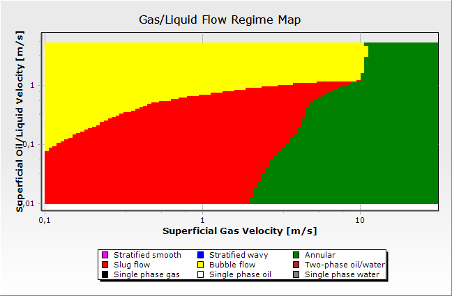 |

**Кейс 4** (beggs_brill, угол 0°, «Горизонтальный трубопровод»):

| FlowMapUtility | OLGA |
|---|---|
|  | 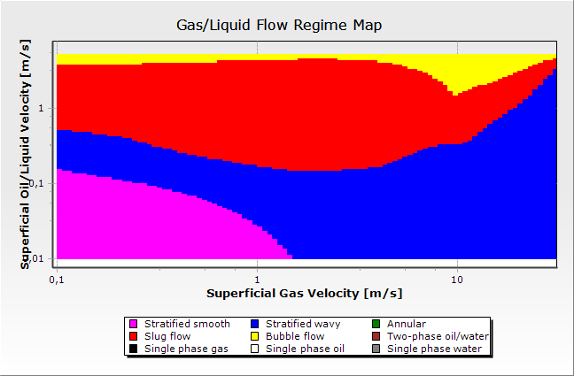 |

**Кейс 6** (beggs_brill, угол 60°, «Крутой наклон — граница моделей»):

| FlowMapUtility | OLGA |
|---|---|
| 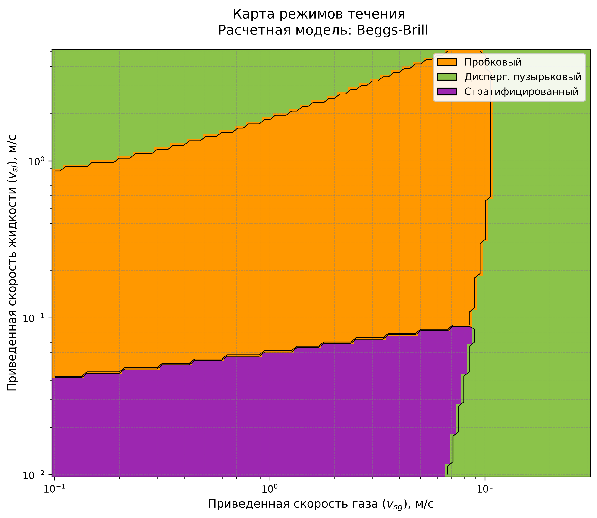 | 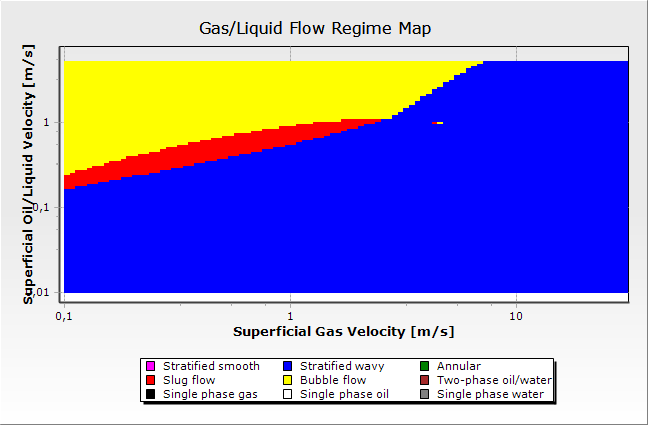 |

Визуально хорошо видно то, что количественно подтверждается матрицами сопряжения (§4.3): граница
кольцевого/пузырькового режима у FlowMapUtility в кейсе 1 представляет собой почти вертикальную линию (порог
не зависит от Vsl), тогда как у OLGA эта граница явно наклонная и растёт с Vsl. В кейсе 6 карта FlowMapUtility
визуально почти не отличается от карты кейса 4 (0°) — угол наклона не входит в классификацию режима у
Беггса-Брилла (см. §3.1, §5), тогда как у OLGA область расслоённого режима (гладкого и волнового суммарно)
в кейсе 6 занимает 74.33% карты — заметно больше, чем в кейсе 4.

### 4.3 Матрицы сопряжения по каждому кейсу

Строки и столбцы каждой матрицы — это **один и тот же** набор из трёх физических режимов, поэтому матрица
квадратная 3×3, а диагональ (выделена в описании как "ok") — это точное совпадение классификаций FlowMapUtility
и OLGA. Значения — число точек сетки (из 10000).

Чтобы получить квадратную матрицу, категории, которые различает только одна из двух моделей, объединены:
у FlowMapUtility — Пузырьковый и Дисперг. пузырьковый (OLGA возвращает для обоих один код Bubble, см. §3.3);
у OLGA — Расслоенный гладкий и Расслоенный волновой (FlowMapUtility возвращает для обоих один код
Stratified). Более детальная, не объединённая разбивка по всем кодам приведена в таблицах площадей §4.1.

**Кейс 1: ansari, угол 90°, «Верт. газоконд. скважина»**

| FlowMapUtility \ OLGA | Пузырьковый | Пробковый | Кольцевой | ИТОГО |
|:---|---:|---:|---:|---:|
| Пузырьковый / Дисперг. пузырьковый | **1260** | 0 | 0 | 1260 |
| Пробковый | 667 | **2373** | 0 | 3040 |
| Кольцевой | 1002 | 1329 | **3369** | 5700 |
| ИТОГО | 2929 | 3702 | 3369 | 10000 |

**Кейс 2: ansari, угол 80°, «Наклонная скважина»**

| FlowMapUtility \ OLGA | Пузырьковый | Пробковый | Кольцевой | ИТОГО |
|:---|---:|---:|---:|---:|
| Пузырьковый / Дисперг. пузырьковый | **1287** | 0 | 0 | 1287 |
| Пробковый | 695 | **2718** | 0 | 3413 |
| Кольцевой | 938 | 1290 | **3072** | 5300 |
| ИТОГО | 2920 | 4008 | 3072 | 10000 |

**Кейс 3: ansari, угол 75°, «Верт. водогазовая скважина»**

| FlowMapUtility \ OLGA | Пузырьковый | Пробковый | Кольцевой | ИТОГО |
|:---|---:|---:|---:|---:|
| Пузырьковый / Дисперг. пузырьковый | **1303** | 0 | 0 | 1303 |
| Пробковый | 831 | **2466** | 0 | 3297 |
| Кольцевой | 855 | 1280 | **3265** | 5400 |
| ИТОГО | 2989 | 3746 | 3265 | 10000 |

**Кейс 4: beggs_brill, угол 0°, «Горизонтальный трубопровод»**

| FlowMapUtility \ OLGA | Расслоенный (гладкий+волновой) | Пробковый | Пузырьковый | ИТОГО |
|:---|---:|---:|---:|---:|
| Стратифицированный | **2724** | 0 | 0 | 2724 |
| Пробковый | 1508 | **3008** | 268 | 4784 |
| Дисперг. пузырьковый | 1296 | 877 | **319** | 2492 |
| ИТОГО | 5528 | 3885 | 587 | 10000 |

**Кейс 5: beggs_brill, угол 30°, «Трубопровод холмистый рельеф»**

| FlowMapUtility \ OLGA | Расслоенный (гладкий+волновой) | Пробковый | Пузырьковый | ИТОГО |
|:---|---:|---:|---:|---:|
| Стратифицированный | **1009** | 1469 | 0 | 2478 |
| Пробковый | 1190 | **2515** | 1003 | 4708 |
| Дисперг. пузырьковый | 1498 | 84 | **1232** | 2814 |
| ИТОГО | 3697 | 4068 | 2235 | 10000 |

**Кейс 6: beggs_brill, угол 60°, «Крутой наклон граница моделей»**

| FlowMapUtility \ OLGA | Расслоенный (гладкий+волновой) | Пробковый | Пузырьковый | ИТОГО |
|:---|---:|---:|---:|---:|
| Стратифицированный | **2154** | 0 | 0 | 2154 |
| Пробковый | 3182 | **428** | 946 | 4556 |
| Дисперг. пузырьковый | 2097 | 0 | **1193** | 3290 |
| ИТОГО | 7433 | 428 | 2139 | 10000 |

**Кейс 7: ansari, угол 90°, «Тяжелая нефть верт. скважина»**

| FlowMapUtility \ OLGA | Пузырьковый | Пробковый | Кольцевой | ИТОГО |
|:---|---:|---:|---:|---:|
| Пузырьковый / Дисперг. пузырьковый | **1235** | 0 | 0 | 1235 |
| Пробковый | 676 | **1909** | 380 | 2965 |
| Кольцевой | 1202 | 967 | **3631** | 5800 |
| ИТОГО | 3113 | 2876 | 4011 | 10000 |

**Кейс 8: beggs_brill, угол 10°, «Слабо наклонный трубопровод»**

| FlowMapUtility \ OLGA | Расслоенный (гладкий+волновой) | Пробковый | Пузырьковый | ИТОГО |
|:---|---:|---:|---:|---:|
| Стратифицированный | **94** | 2823 | 0 | 2917 |
| Пробковый | 39 | **4155** | 652 | 4847* |
| Дисперг. пузырьковый | 1169 | 128 | **939** | 2236 |
| ИТОГО | 1302 | 7106 | 1591 | 10000 |

\* В строке "Пробковый" ещё 1 точка (0.01%) — код OLGA "Однофазная жидкость" (7), не показан отдельным
столбцом ради квадратной формы матрицы; см. примечание к коду 7 в §3.3.

**Кейс 9: beggs_brill, угол 5°, «Морской трубопровод»**

| FlowMapUtility \ OLGA | Расслоенный (гладкий+волновой) | Пробковый | Пузырьковый | ИТОГО |
|:---|---:|---:|---:|---:|
| Стратифицированный | **740** | 2340 | 0 | 3080 |
| Пробковый | 628 | **3616** | 649 | 4893 |
| Дисперг. пузырьковый | 1212 | 67 | **748** | 2027 |
| ИТОГО | 2580 | 6023 | 1397 | 10000 |

**Кейс 10: ansari, угол 90°, «Верт. газовая скважина высокий GLR»**

| FlowMapUtility \ OLGA | Пузырьковый | Пробковый | Кольцевой | ИТОГО |
|:---|---:|---:|---:|---:|
| Пузырьковый / Дисперг. пузырьковый | **1263** | 2 | 0 | 1265 |
| Пробковый | 344 | **2791** | 0 | 3135 |
| Кольцевой | 690 | 1250 | **3660** | 5600 |
| ИТОГО | 2297 | 4043 | 3660 | 10000 |

### 4.4 Агрегированные результаты по семействам моделей

Как и в §4.3, категории объединены до трёх физических режимов, общих для обеих моделей, чтобы получить
квадратную матрицу с содержательной диагональю.

**Ansari (кейсы 1, 2, 3, 7, 10) — всего 50000 точек**

Число точек:

| FlowMapUtility \ OLGA | Пузырьковый | Пробковый | Кольцевой | ИТОГО |
|:---|---:|---:|---:|---:|
| Пузырьковый / Дисперг. пузырьковый | **6348** | 2 | 0 | 6350 |
| Пробковый | 3213 | **12257** | 380 | 15850 |
| Кольцевой | 4687 | 6116 | **16997** | 27800 |
| ИТОГО | 14248 | 18375 | 17377 | 50000 |

Доля по строке, %:

| FlowMapUtility \ OLGA | Пузырьковый | Пробковый | Кольцевой |
|:---|---:|---:|---:|
| Пузырьковый / Дисперг. пузырьковый | **100.0** | 0.0 | 0.0 |
| Пробковый | 20.3 | **77.3** | 2.4 |
| Кольцевой | 16.9 | 22.0 | **61.1** |

**Beggs-Brill (кейсы 4, 5, 6, 8, 9) — всего 50000 точек**

Число точек:

| FlowMapUtility \ OLGA | Расслоенный (гладкий+волновой) | Пробковый | Пузырьковый | ИТОГО |
|:---|---:|---:|---:|---:|
| Стратифицированный | **6721** | 6632 | 0 | 13353 |
| Пробковый | 6547 | **13722** | 3518 | 23788* |
| Дисперг. пузырьковый | 7272 | 1156 | **4431** | 12859 |
| ИТОГО | 20540 | 21510 | 7949 | 50000* |

\* Без учёта 1 точки (0.002% от 50000) с кодом OLGA "Однофазная жидкость" (7) в кейсе 8, см. примечание в §4.3.

Доля по строке, %:

| FlowMapUtility \ OLGA | Расслоенный (гладкий+волновой) | Пробковый | Пузырьковый |
|:---|---:|---:|---:|
| Стратифицированный | **50.3** | 49.7 | 0.0 |
| Пробковый | 27.5 | **57.7** | 14.8 |
| Дисперг. пузырьковый | 56.6 | 9.0 | **34.5** |

Из таблицы для Beggs-Brill хорошо видно источник расхождения: 56.6% точек, которые FlowMapUtility относит к
Дисперг. пузырьковому режиму, у OLGA попадают в объединённый Расслоенный режим (в подавляющем большинстве —
именно Расслоенный волновой, код 1, см. §4.1) — то есть OLGA в этих точках всё ещё видит расслоённое течение
там, где классическая корреляция Беггса-Брилла уже считает поток достаточно турбулентным для
дисперсно-пузырькового режима (детальное обсуждение — §5).

### 4.5 Итоговое совпадение по кейсам

Совпадением засчитывается пара кодов, соответствующая одному физическому режиму (определение см. §3.3):
Пузырьковый/Дисперг. пузырьковый ↔ Пузырьковый (OLGA), Пробковый ↔ Пробковый (OLGA), Кольцевой ↔ Кольцевой
(OLGA) (для Ансари); Стратифицированный ↔ Расслоенный гладкий **или** Расслоенный волновой (OLGA), Пробковый ↔
Пробковый (OLGA), Дисперг. пузырьковый ↔ Пузырьковый (OLGA) (для Беггс-Брилл).

**Ансари (75–90°)**

| Кейс | Модель | Угол, ° | Совпадение, % | Пузырьковый (совпадение) | Пробковый (совпадение) | Кольцевой (совпадение) |
|-------:|:---------|-------:|------------:|:-------------------|:------------------|:------------------|
| 1 | Ансари | 90 | 70.0 | 1260/1260 (100.0%) | 2373/3040 (78.1%) | 3369/5700 (59.1%) |
| 2 | Ансари | 80 | 70.8 | 1287/1287 (100.0%) | 2718/3413 (79.6%) | 3072/5300 (58.0%) |
| 3 | Ансари | 75 | 70.3 | 1303/1303 (100.0%) | 2466/3297 (74.8%) | 3265/5400 (60.5%) |
| 7 | Ансари | 90 | 67.8 | 1235/1235 (100.0%) | 1909/2965 (64.4%) | 3631/5800 (62.6%) |
| 10 | Ансари | 90 | 77.1 | 1263/1265 (99.8%) | 2791/3135 (89.0%) | 3660/5600 (65.4%) |

**Беггс-Брилл (0–60°)**

| Кейс | Модель | Угол, ° | Совпадение, % | Стратифицированный (совпадение) | Пробковый (совпадение) | Дисперг. пузырьковый (совпадение) |
|-------:|:------------|-------:|------------:|:------------------|:------------------|:------------------|
| 4 | Беггс-Брилл | 0 | 60.5 | 2724/2724 (100.0%) | 3008/4784 (62.9%) | 319/2492 (12.8%) |
| 5 | Беггс-Брилл | 30 | 47.6 | 1009/2478 (40.7%) | 2515/4708 (53.4%) | 1232/2814 (43.8%) |
| 6 | Беггс-Брилл | 60 | 37.8 | 2154/2154 (100.0%) | 428/4556 (9.4%) | 1193/3290 (36.3%) |
| 8 | Беггс-Брилл | 10 | 51.9 | 94/2917 (3.2%) | 4155/4847 (85.7%) | 939/2236 (42.0%) |
| 9 | Беггс-Брилл | 5 | 51.0 | 740/3080 (24.0%) | 3616/4893 (73.9%) | 748/2027 (36.9%) |

Суммарное (взвешенное по всем точкам) совпадение: **71.2%** для семейства Ансари (50000 точек) и **49.7%** для
семейства Беггс-Брилл (50000 точек); по всем 10 кейсам вместе — **60.5%** (60476 из 100000 точек). Столбец
"Стратифицированный (совпадение)" для Беггс-Брилла демонстрирует неоднородную, но местами очень высокую точность (100% в кейсах 4 и 6 — там, где у FlowMapUtility стратифицированный
режим ни разу не попадает в Пробковый/Пузырьковый код OLGA), тогда как столбец "Дисперг. пузырьковый
(совпадение)" показывает низкую и умеренную точность (12.8–43.8%) — именно дисперсно-пузырьковый режим является
главным источником расхождения для семейства Беггс-Брилл (см. §5).

### 4.6 Сравнение границ режимов

**Граница начала Кольцевого режима (кейсы Ансари), по срезам Vsl.** Важное наблюдение: у модели Ансари порог
начала кольцевого режима (`vsg3` в `ansari.py`, см. формулу §3.1) **не зависит от Vsl** — это константа. У OLGA
граница явно растёт с Vsl. Из-за этого на малых Vsl FlowMapUtility и OLGA близки, а на больших Vsl расхождение
доходит до 10+ м/с.

**Кейс 1** (угол 90°, «Верт. газоконд. скважина»):

|   Vsl, м/с |   Vsg нач. Кольцевого (FlowMapUtility), м/с |   Vsg нач. Кольцевого (OLGA), м/с |   Δ, м/с |
|-----------:|------------------------------:|-------------------------------:|-------------:|
|      0.01  |                         1.191 |                          2     |       -0.809 |
|      0.02  |                         1.191 |                          2.245 |       -1.054 |
|      0.04  |                         1.191 |                          2.519 |       -1.328 |
|      0.079 |                         1.191 |                          3.172 |       -1.981 |
|      0.158 |                         1.191 |                          3.994 |       -2.803 |
|      0.316 |                         1.191 |                          4.481 |       -3.29  |
|      0.63  |                         1.191 |                          5.643 |       -4.452 |
|      1.257 |                         1.191 |                         10.04  |       -8.849 |
|      2.507 |                         1.191 |                         10.635 |       -9.444 |
|      5     |                         1.191 |                         10.635 |       -9.444 |

**Кейс 2** (угол 80°, «Наклонная скважина»):

|   Vsl, м/с |   Vsg нач. Кольцевого (FlowMapUtility), м/с |   Vsg нач. Кольцевого (OLGA), м/с |   Δ, м/с |
|-----------:|------------------------------:|-------------------------------:|-------------:|
|      0.01  |                           1.5 |                          2.519 |       -1.019 |
|      0.02  |                           1.5 |                          2.668 |       -1.169 |
|      0.04  |                           1.5 |                          2.994 |       -1.494 |
|      0.079 |                           1.5 |                          3.559 |       -2.059 |
|      0.158 |                           1.5 |                          4.747 |       -3.247 |
|      0.316 |                           1.5 |                          5.327 |       -3.827 |
|      0.63  |                           1.5 |                          7.105 |       -5.606 |
|      1.257 |                           1.5 |                         11.266 |       -9.766 |
|      2.507 |                           1.5 |                         12.642 |      -11.142 |
|      5     |                           1.5 |                         12.642 |      -11.142 |

**Кейс 3** (угол 75°, «Верт. водогазовая скважина»):

|   Vsl, м/с |   Vsg нач. Кольцевого (FlowMapUtility), м/с |   Vsg нач. Кольцевого (OLGA), м/с |   Δ, м/с |
|-----------:|------------------------------:|-------------------------------:|-------------:|
|      0.01  |                         1.416 |                          2.519 |       -1.103 |
|      0.02  |                         1.416 |                          2.668 |       -1.252 |
|      0.04  |                         1.416 |                          3.172 |       -1.756 |
|      0.079 |                         1.416 |                          3.559 |       -2.143 |
|      0.158 |                         1.416 |                          4.481 |       -3.066 |
|      0.316 |                         1.416 |                          5.029 |       -3.613 |
|      0.63  |                         1.416 |                          5.643 |       -4.227 |
|      1.257 |                         1.416 |                          8.446 |       -7.03  |
|      2.507 |                         1.416 |                          9.477 |       -8.062 |
|      5     |                         1.416 |                          9.477 |       -8.062 |

**Кейс 7** (угол 90°, «Тяжелая нефть верт. скважина»):

|   Vsl, м/с |   Vsg нач. Кольцевого (FlowMapUtility), м/с |   Vsg нач. Кольцевого (OLGA), м/с |   Δ, м/с |
|-----------:|------------------------------:|-------------------------------:|-------------:|
|      0.01  |                         1.124 |                          0.133 |        0.991 |
|      0.02  |                         1.124 |                          0.563 |        0.561 |
|      0.04  |                         1.124 |                          0.893 |        0.231 |
|      0.079 |                         1.124 |                          1.683 |       -0.559 |
|      0.158 |                         1.124 |                          3.559 |       -2.435 |
|      0.316 |                         1.124 |                          4.481 |       -3.357 |
|      0.63  |                         1.124 |                          6.332 |       -5.208 |
|      1.257 |                         1.124 |                         13.391 |      -12.267 |
|      2.507 |                         1.124 |                         16.862 |      -15.738 |
|      5     |                         1.124 |                         20.043 |      -18.919 |

**Кейс 10** (угол 90°, «Верт. газовая скважина высокий GLR»):

|   Vsl, м/с |   Vsg нач. Кольцевого (FlowMapUtility), м/с |   Vsg нач. Кольцевого (OLGA), м/с |   Δ, м/с |
|-----------:|------------------------------:|-------------------------------:|-------------:|
|      0.01  |                         1.262 |                          2     |       -0.739 |
|      0.02  |                         1.262 |                          2.119 |       -0.857 |
|      0.04  |                         1.262 |                          2.245 |       -0.983 |
|      0.079 |                         1.262 |                          2.519 |       -1.257 |
|      0.158 |                         1.262 |                          2.994 |       -1.732 |
|      0.316 |                         1.262 |                          3.559 |       -2.297 |
|      0.63  |                         1.262 |                          4.231 |       -2.969 |
|      1.257 |                         1.262 |                          5.978 |       -4.716 |
|      2.507 |                         1.262 |                         12.642 |      -11.38  |
|      5     |                         1.262 |                         12.642 |      -11.38  |

**Площадь расслоённого режима (кейс 4, угол 0° — горизонталь, без влияния угла).** В отличие от Ансари, для
Беггс-Брилл протестировать границу расслоённого режима одной линией "Vsg(Vsl)" некорректно: в экспортированной
карте OLGA код "Расслоенный волновой" (1) для горизонтальной трубы встречается не только сразу после кода
"Расслоенный гладкий" (0), но и повторно на самых высоких значениях Vsg при умеренных Vsl (после зоны
Пробкового режима) — то есть граница расслоённого режима у OLGA в этом кейсе не монотонна по Vsg, поскольку
для истинно горизонтальной трубы в экспортируемой карте OLGA нет отдельной категории "кольцевой/дисперсный",
и часть высокоскоростных точек по газу возвращается в категорию "расслоённый волновой". Поэтому для честного
сравнения используется не граница, а суммарная площадь: **OLGA относит к расслоённому семейству (коды 0+1)
55.28% карты кейса 4, тогда как FlowMapUtility — только 27.24%** (см. §4.1). Иными словами, классическая
граница Беггса-Брилла ($N_{Fr} \le 0.000925\,\lambda_l^{-2.468}$) отдаёт в пробковый и дисперсно-пузырьковый
режимы почти вдвое большую долю карты, чем показывает OLGA.

## 5. Обсуждение

**Кейсы Ансари (вертикальные/сильно наклонные скважины, 75–90°) — совпадение 68–77%, лучшее среди всех.** Режимы
Пузырьковый и Дисперг. пузырьковый у FlowMapUtility в 99.8–100% случаев попадают в код OLGA «Пузырьковый» (OLGA
их вообще не различает). Пробковый режим совпадает на 64–89%. Главный источник расхождения — Кольцевой режим:
совпадает только 58–65%, потому что порог начала кольцевого режима у модели Ансари — константа по Vsg, не
зависящая от Vsl (см. формулу в §3.1), а у OLGA граница явно растёт с Vsl (§4.6). На малых Vsl расхождение по
границе — доли м/с, на больших Vsl (2.5–5 м/с) — 9–19 м/с.

**Кейсы Беггс-Брилл (горизонталь/наклон, 0–60°) — совпадение 38–60%, заметно хуже.** Столбец «Стратифицированный
(совпадение)» показывает 100% в кейсах 4 и 6, но не потому, что классическая граница расслоённого режима точна —
а потому,
что *все* точки, где FlowMapUtility ставит Стратифицированный режим, попадают либо в код 0, либо в код 1 OLGA
(оба физически — расслоённое течение), то есть FlowMapUtility никогда не ошибается "в другую сторону" в этих
точках. Настоящая проблема — противоположная: **FlowMapUtility относит к расслоённому режиму значительно меньшую
площадь карты, чем OLGA** (27.24% против 55.28% в кейсе 4, см. §4.6), а недостающая площадь у FlowMapUtility
уходит в Пробковый и особенно в Дисперг. пузырьковый режим. Именно поэтому точность распознавания Дисперг.
пузырькового режима низкая (12.8–43.8%, §4.5) — 34.5–56.6% точек, отмеченных FlowMapUtility как дисперсно-
пузырьковые, OLGA классифицирует как расслоённый волновой (§4.4). Структурная причина — сама формула
Беггса-Брилла для верхней границы расслоённого режима ($N_{Fr} \le 0.000925\,\lambda_l^{-2.468}$) при малом $\lambda_l$
(малая доля жидкости) быстро формально "выпускает" поток из расслоённого режима, что не соответствует более
консервативной (в терминах сохранения расслоённого течения при высоких Vsg) классификации OLGA. Кроме того,
классификация режима у Беггса-Брилла вообще не учитывает угол наклона трубы (это точное следование
оригинальной статье 1973 года: там угол используется только в расчёте удержания жидкости, см. §2.2), поэтому
карта режимов у FlowMapUtility для кейса 4 (0°) и кейса 6 (60°) идентичны по форме, тогда как у OLGA площадь
расслоённого семейства растёт с 55.28% (0°) до 74.33% (60°). Кейс 6 (угол 60° — на стыке диапазонов
применимости моделей Ансари и Беггса-Брилла) закономерно показывает одно из наихудших совпадений по Пробковому
режиму (9.4%): классическая карта Беггса-Брилла не предназначена для крутых углов, для которых в литературе
рекомендуется единая модель Барнеа (Barnea, 1987), явно учитывающая угол наклона в критериях перехода между
режимами.

В совокупности результаты показывают, что расхождения между классическими корреляциями и промышленным
симулятором носят не случайный, а систематический характер, напрямую выводимый из структуры исходных уравнений
1973 и 1994 годов. Это согласуется с общей тенденцией в литературе по многофазному потоку: модели, разработанные
для узкого диапазона условий (углы наклона, диаметры труб, свойства флюидов лабораторных экспериментов),
сохраняют топологию границ режимов за пределами калибровочного диапазона, даже когда реальная физика перехода
меняется. Поскольку внутренние корреляции OLGA закрыты (§2.3), дальнейшая детализация причин расхождения со
стороны OLGA невозможна — все объяснения в данном разделе относятся к структуре именно классических корреляций,
что и было целью работы.

## 6. Заключение

Выполнено количественное сопоставление классификации режимов течения, полученной классическими корреляциями
Ансари (1994) и Беггса-Брилла (1973), реализованными в FlowMapUtility, с результатами промышленного симулятора
OLGA (Schlumberger) на 10 представительных сценариях скважин и трубопроводов (100 000 точек сравнения), с
использованием официальной легенды кодов режимов OLGA. Показано, что:

1. Для около-вертикальных скважин (модель Ансари, углы 75–90°) совпадение классификации с OLGA составляет
   68–77%, при этом пузырьковый и дисперсно-пузырьковый режимы распознаются практически безошибочно (99.8–100%),
   а основные расхождения сосредоточены на границе кольцевого режима, порог которой у модели Ансари не зависит
   от скорости жидкости.
2. Для горизонтальных и наклонных трубопроводов (модель Беггса-Брилла, углы 0–60°) совпадение заметно ниже
   (38–60%). Основная причина — модель Беггса-Брилла отдаёт в пробковый и дисперсно-пузырьковый режимы
   существенно большую долю карты, чем OLGA относит к расслоённому течению (в кейсе 4: 27.24% против 55.28%), а
   не наоборот, как можно было бы предположить по внешнему виду классической границы расслоённого режима.
3. Классификация режима у модели Беггса-Брилла вообще не зависит от угла наклона трубы — прямое следствие
   исходной работы 1973 года, — тогда как у OLGA доля расслоённого режима заметно растёт с углом наклона
   (55.28% при 0° → 74.33% при 60°), что дополнительно увеличивает расхождение на больших углах.
4. Оба расхождения носят структурный, а не случайный характер и напрямую выводятся из математической формы
   исходных корреляций, а не являются ошибками программной реализации.
5. Использование классических корреляций Ансари и Беггса-Брилла для построения карт режимов течения без
   модификаций даёт приемлемую точность (≥68%) только для около-вертикальных скважин; для наклонных
   трубопроводов точность составляет 38–60%, что требует осторожности при практическом применении и указывает
   на целесообразность перехода к более современным механистическим моделям (например, единой модели Барнеа)
   для таких условий.

## 7. Направления дальнейших исследований

- Для модели Ансари: оценить целесообразность модификации порога начала кольцевого режима (`vsg3`), сделав его
  зависимым от Vsl, если сопоставление с OLGA принимается как целевой бенчмарк.
- Для модели Беггса-Брилла: пересмотреть верхнюю границу расслоённого режима
  ($N_{Fr} \le 0.000925\,\lambda_l^{-2.468}$) в сторону более консервативного (по площади расслоённого режима)
  критерия, и рассмотреть переход на модель с явным учётом угла наклона в границах режима (например, единую
  модель Барнеа (Barnea, 1987) или Taitel-Dukler (1976) с поправкой Barnea) для сценариев с углом наклона более
  30°.
- Расширение набора корреляций: добавить в сравнение другие классические и механистические модели (например,
  Тайтела-Даклера, единую модель Барнеа), чтобы оценить, насколько общей является наблюдаемая картина
  расхождений с OLGA, а не ограничиваться только моделями Ансари и Беггса-Брилла.

## Список литературы

1. Ansari, A.M., Sylvester, N.D., Sarica, C., Shoham, O., Brill, J.P. A Comprehensive Mechanistic Model for
   Upward Two-Phase Flow in Wellbores // SPE Production & Facilities. — 1994. — Vol. 9, No. 2. — P. 143–151.
2. Beggs, H.D., Brill, J.P. A Study of Two-Phase Flow in Inclined Pipes // Journal of Petroleum Technology. —
   1973. — Vol. 25, No. 5. — P. 607–617.
3. Taitel, Y., Dukler, A.E. A Model for Predicting Flow Regime Transitions in Horizontal and Near Horizontal
   Gas-Liquid Flow // AIChE Journal. — 1976. — Vol. 22, No. 1. — P. 47–55.
4. Barnea, D. A Unified Model for Predicting Flow-Pattern Transitions for the Whole Range of Pipe
   Inclinations // International Journal of Multiphase Flow. — 1987. — Vol. 13, No. 1. — P. 1–12.
5. Mandhane, J.M., Gregory, G.A., Aziz, K. A Flow Pattern Map for Gas-Liquid Flow in Horizontal Pipes //
   International Journal of Multiphase Flow. — 1974. — Vol. 1, No. 4. — P. 537–553.
6. Baker, O. Simultaneous Flow of Oil and Gas // Oil and Gas Journal. — 1954. — Vol. 53. — P. 185–195.

## Приложение А. Карты режимов течения для всех 10 кейсов

В §4.2 визуальное сопоставление карт приведено только для трёх представительных кейсов. Ниже — полный набор
карт режимов течения для всех 10 кейсов (параметры каждого кейса см. §3.2), в том же формате: слева —
FlowMapUtility, справа — OLGA. Оси на картах OLGA — Vsg (X) и Vsl (Y) в м/с, логарифмическая шкала; легенда
режимов встроена в изображение (соответствие кодов режимов — см. §3.3).

**Кейс 1** (ansari, угол 90°, «Верт. газоконд. скважина»):

| FlowMapUtility | OLGA |
|---|---|
|  |  |

**Кейс 2** (ansari, угол 80°, «Наклонная скважина»):

| FlowMapUtility | OLGA |
|---|---|
| 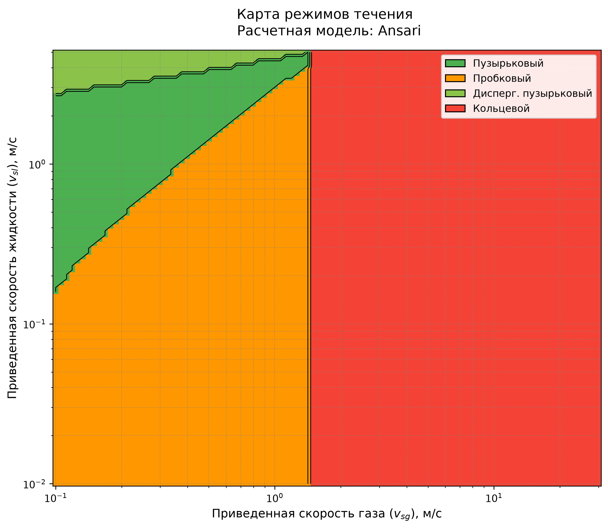 | 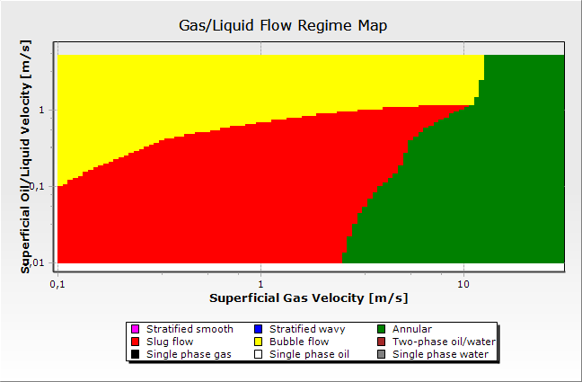 |

**Кейс 3** (ansari, угол 75°, «Верт. водогазовая скважина»):

| FlowMapUtility | OLGA |
|---|---|
| 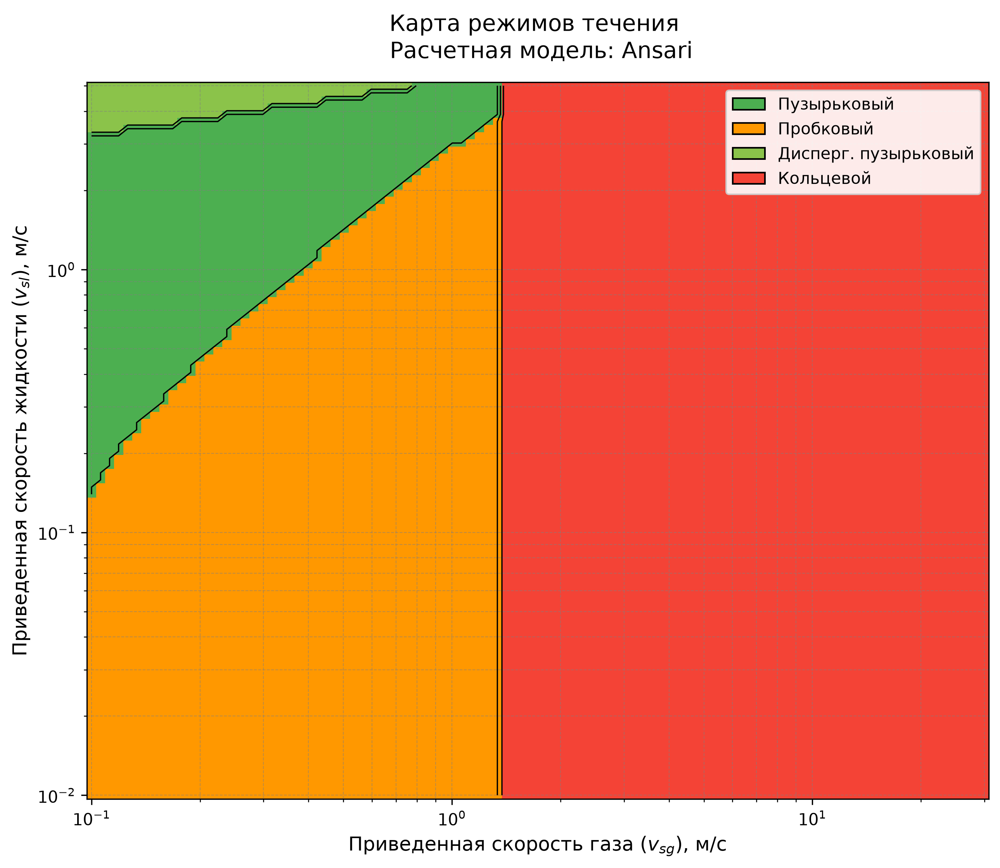 | 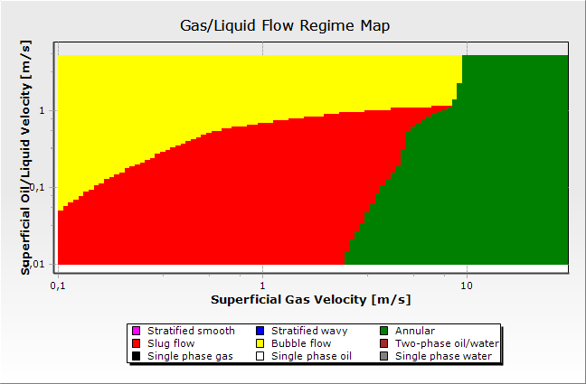 |

**Кейс 4** (beggs_brill, угол 0°, «Горизонтальный трубопровод»):

| FlowMapUtility | OLGA |
|---|---|
|  |  |

**Кейс 5** (beggs_brill, угол 30°, «Трубопровод холмистый рельеф»):

| FlowMapUtility | OLGA |
|---|---|
| 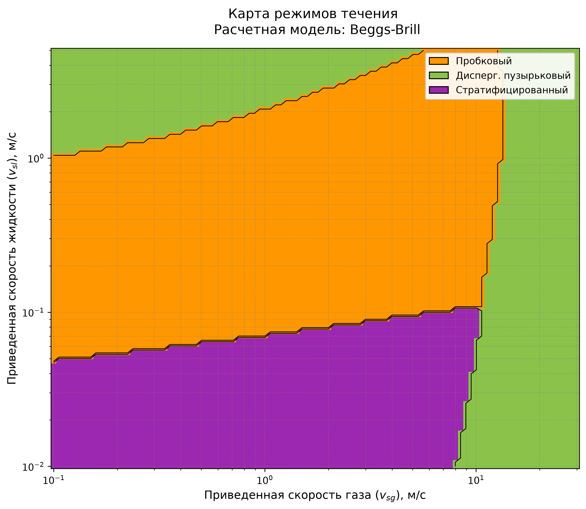 | 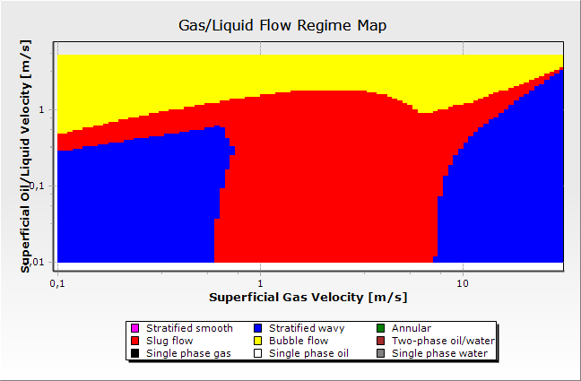 |

**Кейс 6** (beggs_brill, угол 60°, «Крутой наклон граница моделей»):

| FlowMapUtility | OLGA |
|---|---|
|  |  |

**Кейс 7** (ansari, угол 90°, «Тяжелая нефть верт. скважина»):

| FlowMapUtility | OLGA |
|---|---|
| 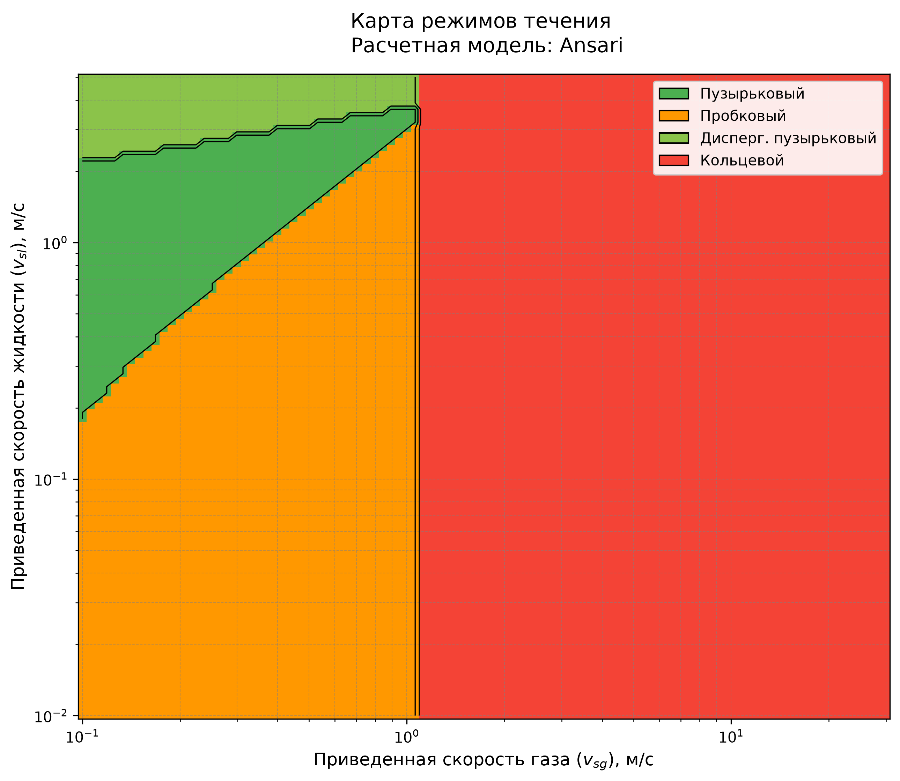 | 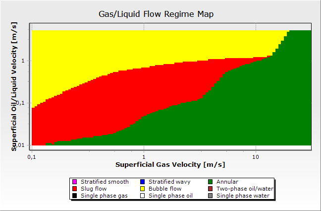 |

**Кейс 8** (beggs_brill, угол 10°, «Слабо наклонный трубопровод»):

| FlowMapUtility | OLGA |
|---|---|
| 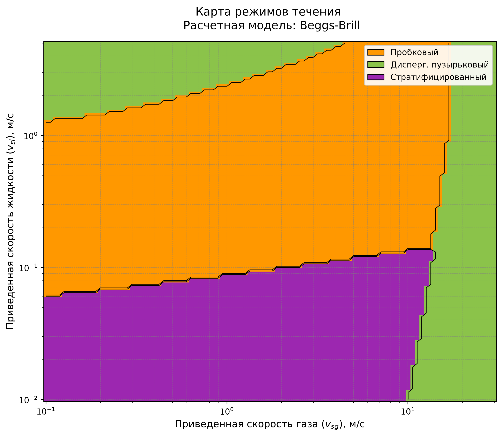 | 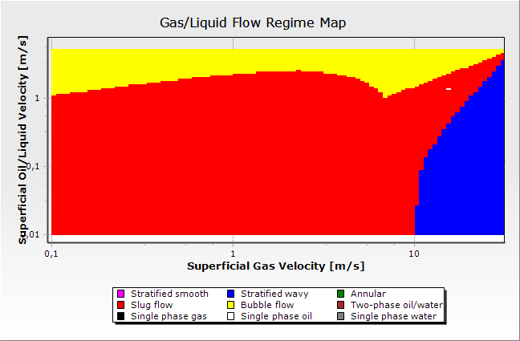 |

**Кейс 9** (beggs_brill, угол 5°, «Морской трубопровод»):

| FlowMapUtility | OLGA |
|---|---|
| 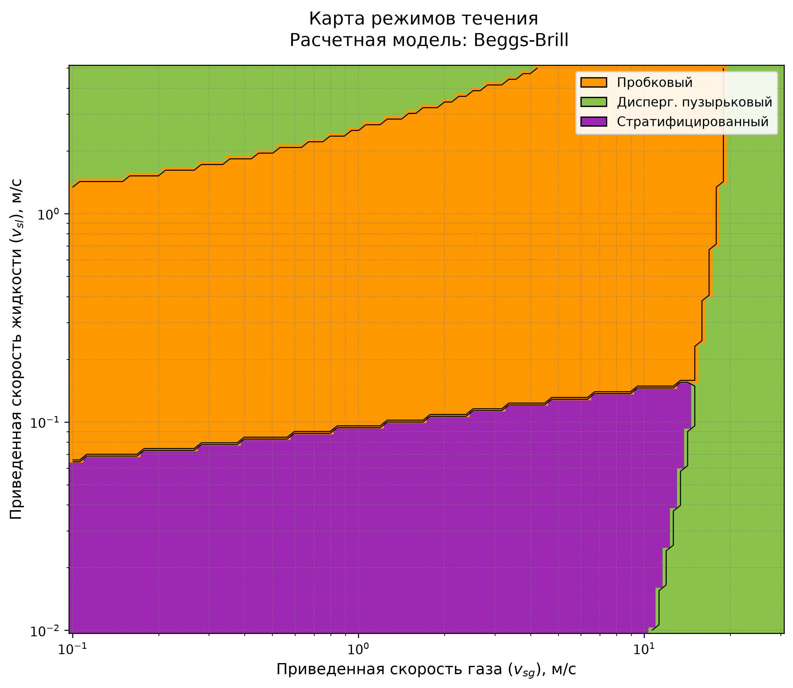 | 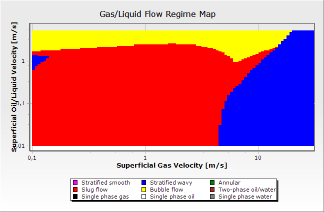 |

**Кейс 10** (ansari, угол 90°, «Верт. газовая скважина высокий GLR»):

| FlowMapUtility | OLGA |
|---|---|
| 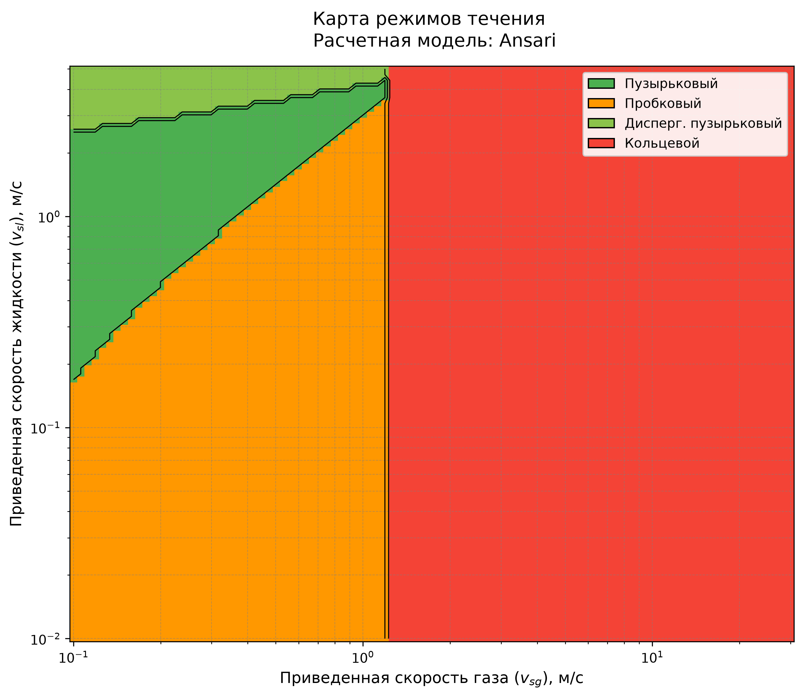 | 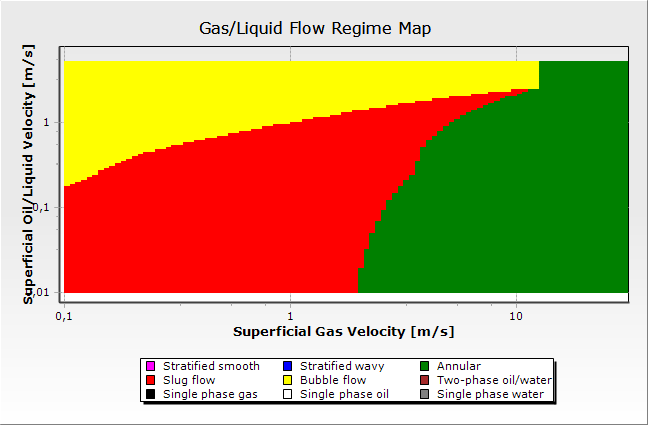 |
